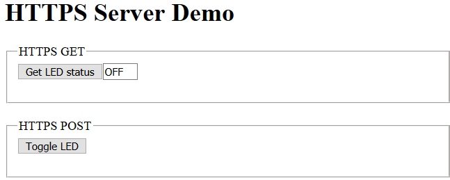

# AIROC&trade; CYW43907 Secure HTTP server

This code example demonstrates the implementation of an HTTPS server with AIROC&trade; CYW43907 MCU .

It employs the [HTTPS server](https://github.com/Infineon/http-server) middleware library, which takes care of all the underlying socket connections with the HTTPS client. In this example, the HTTPS server establishes a secure connection with an HTTPS client through SSL handshake. Once the SSL handshake completes successfully, the HTTPS client can make GET, POST, and PUT requests with the server.

[View this README on GitHub.](https://github.com/Infineon/mtb-example-cyw43907-secure-http-server)

[Provide feedback on this code example.](https://cypress.co1.qualtrics.com/jfe/form/SV_1NTns53sK2yiljn?Q_EED=eyJVbmlxdWUgRG9jIElkIjoiQ0UyMzQwOTYiLCJTcGVjIE51bWJlciI6IjAwMi0zNDA5NiIsIkRvYyBUaXRsZSI6IkFJUk9DJnRyYWRlOyBDWVc0MzkwNyBTZWN1cmUgSFRUUCBzZXJ2ZXIiLCJyaWQiOiJ2ZWxtdXJ1Z2FuIiwiRG9jIHZlcnNpb24iOiIyLjAuMCIsIkRvYyBMYW5ndWFnZSI6IkVuZ2xpc2giLCJEb2MgRGl2aXNpb24iOiJNQ0QiLCJEb2MgQlUiOiJJQ1ciLCJEb2MgRmFtaWx5IjoiV0lGSSJ9)


## Requirements

- [ModusToolbox&trade; software](https://www.infineon.com/modustoolbox) v3.1 or later (tested with v3.1)
- Board support package (BSP) minimum required version: 1.0.0
- Programming language: C
- Associated parts: [AIROC&trade; CYW43907 embedded wireless SoC ](https://www.infineon.com/cms/en/product/wireless-connectivity/airoc-connected-mcu/cyw43907)


## Supported toolchains (make variable 'TOOLCHAIN')

- GNU Arm&reg; embedded compiler v11.3.1 (`GCC_ARM`) - Default value of `TOOLCHAIN`

## Supported kits (make variable 'TARGET')

- [AIROC&trade; CYW43907 embedded wireless SoC kit](https://www.infineon.com/cms/en/product/evaluation-boards/cyw943907aeval1f) (`CYW943907AEVAL1F`) – Default value of `TARGET`

## Hardware setup

This example uses the board's default configuration. See the kit user guide to ensure that the board is configured correctly.

## Software setup

Install a terminal emulator if you don't have one. Instructions in this document use [PuTTY](https://www.putty.org/).

**Note:** This code example also uses the *cURL* utility to test the HTTPS server. This utility helps to send HTTPS GET, POST, and PUT requests to the server. The *cURL* utility (version 8.0.1) is already shipped with the ModusToolbox&trade; software v3.1 and later; it is available under *{ModusToolbox&trade; install directory}/tools_\<version>/modus-shell/bin*.

## Using the code example

Create the project and open it using one of the following:

<details><summary><b>In Eclipse IDE for ModusToolbox&trade; software</b></summary>

1. Click the **New Application** link in the **Quick Panel** (or, use **File** > **New** > **ModusToolbox&trade; Application**). This launches the [Project Creator](https://www.infineon.com/ModusToolboxProjectCreator) tool.

2. Pick a kit supported by the code example from the list shown in the **Project Creator - Choose Board Support Package (BSP)** dialog.

   When you select a supported kit, the example is reconfigured automatically to work with the kit. To work with a different supported kit later, use the [Library Manager](https://www.infineon.com/ModusToolboxLibraryManager) to choose the BSP for the supported kit. You can use the Library Manager to select or update the BSP and firmware libraries used in this application. To access the Library Manager, click the link from the **Quick Panel**.

   You can also just start the application creation process again and select a different kit.

   If you want to use the application for a kit not listed here, you may need to update the source files. If the kit does not have the required resources, the application may not work.

3. In the **Project Creator - Select Application** dialog, choose the example by enabling the checkbox.

4. (Optional) Change the suggested **New Application Name**.

5. The **Application(s) Root Path** defaults to the Eclipse workspace which is usually the desired location for the application. If you want to store the application in a different location, you can change the *Application(s) Root Path* value. Applications that share libraries should be in the same root path.

6. Click **Create** to complete the application creation process.

For more details, see the [Eclipse IDE for ModusToolbox&trade; software user guide](https://www.infineon.com/MTBEclipseIDEUserGuide) (locally available at *{ModusToolbox&trade; software install directory}/docs_{version}/mt_ide_user_guide.pdf*).

</details>

<details><summary><b>In command-line interface (CLI)</b></summary>

ModusToolbox&trade; software provides the Project Creator as both a GUI tool and the command line tool, "project-creator-cli". The CLI tool can be used to create applications from a CLI terminal or from within batch files or shell scripts. This tool is available in the *{ModusToolbox&trade; software install directory}/tools_{version}/project-creator/* directory.

Use a CLI terminal to invoke the "project-creator-cli" tool. On Windows, use the command line "modus-shell" program provided in the ModusToolbox&trade; software installation instead of a standard Windows command-line application. This shell provides access to all ModusToolbox&trade; software tools. You can access it by typing `modus-shell` in the search box in the Windows menu. In Linux and macOS, you can use any terminal application.

The "project-creator-cli" tool has the following arguments:

Argument | Description | Required/optional
---------|-------------|-----------
`--board-id` | Defined in the `<id>` field of the [BSP](https://github.com/Infineon?q=bsp-manifest&type=&language=&sort=) manifest | Required
`--app-id`   | Defined in the `<id>` field of the [CE](https://github.com/Infineon?q=ce-manifest&type=&language=&sort=) manifest | Required
`--target-dir`| Specify the directory in which the application is to be created if you prefer not to use the default current working directory | Optional
`--user-app-name`| Specify the name of the application if you prefer to have a name other than the example's default name | Optional

<br />

The following example clones the "[mtb-example-cyw43907-secure-http-server](https://github.com/Infineon/mtb-example-cyw43907-secure-http-server)" application with the desired name "SecureHttpServer" configured for the *CYW943907AEVAL1F* BSP into the specified working directory, *C:/mtb_projects*:

   ```
   project-creator-cli --board-id CYW943907AEVAL1F --app-id mtb-example-cyw43907-secure-http-server --user-app-name SecureHttpServer --target-dir "C:/mtb_projects"
   ```

**Note:** The project-creator-cli tool uses the `git clone` and `make getlibs` commands to fetch the repository and import the required libraries. For details, see the "Project creator tools" section of the [ModusToolbox&trade; software user guide](https://www.infineon.com/ModusToolboxUserGuide) (locally available at *{ModusToolbox&trade; software install directory}/docs_{version}/mtb_user_guide.pdf*).

To work with a different supported kit later, use the [Library Manager](https://www.infineon.com/ModusToolboxLibraryManager) to choose the BSP for the supported kit. You can invoke the Library Manager GUI tool from the terminal using `make library-manager` command or use the Library Manager CLI tool "library-manager-cli" to change the BSP.

The "library-manager-cli" tool has the following arguments:

Argument | Description | Required/optional
---------|-------------|-----------
`--add-bsp-name` | Name of the BSP that should be added to the application | Required
`--set-active-bsp` | Name of the BSP that should be as active BSP for the application | Required
`--add-bsp-version`| Specify the version of the BSP that should be added to the application if you do not wish to use the latest from manifest | Optional
`--add-bsp-location`| Specify the location of the BSP (local/shared) if you prefer to add the BSP in a shared path | Optional

<br />

Following example adds the CYW943907AEVAL1F BSP to the already created application and makes it the active BSP for the app:

   ```
   ~/ModusToolbox/tools_{3.1}/library-manager/library-manager-cli --project "C:/mtb-example-cyw43907-secure-http-server" --add-bsp-name CYW943907AEVAL1F --add-bsp-version "latest-v1.X" --add-bsp-location "local"

   ~/ModusToolbox/tools_{3.1}/library-manager/library-manager-cli --project "C:/mtb-example-cyw43907-secure-http-server" --set-active-bsp APP_CYW943907AEVAL1F
   ```

</details>

<details><summary><b>In third-party IDEs</b></summary>

Use one of the following options:

- **Use the standalone [Project Creator](https://www.infineon.com/ModusToolboxProjectCreator) tool:**

   1. Launch Project Creator from the Windows Start menu or from *{ModusToolbox&trade; software install directory}/tools_{version}/project-creator/project-creator.exe*.

   2. In the initial **Choose Board Support Package** screen, select the BSP, and click **Next**.

   3. In the **Select Application** screen, select the appropriate IDE from the **Target IDE** drop-down menu.

   4. Click **Create** and follow the instructions printed in the bottom pane to import or open the exported project in the respective IDE.

<br />

- **Use command-line interface (CLI):**

   1. Follow the instructions from the **In command-line interface (CLI)** section to create the application, and then import the libraries using the `make getlibs` command.

   2. Export the application to a supported IDE using the `make <ide>` command.

   3. Follow the instructions displayed in the terminal to create or import the application as an IDE project.

For a list of supported IDEs and more details, see the "Exporting to IDEs" section of the [ModusToolbox&trade; software user guide](https://www.infineon.com/ModusToolboxUserGuide) (locally available at *{ModusToolbox&trade; software install directory}/docs_{version}/mtb_user_guide.pdf*).

</details>


## Operation

1. Connect the board to your PC using the provided USB cable through the micro-USB USB connector.

2. Open *secure_http_server.h* and modify the `WIFI_SSID`, `WIFI_PASSWORD`, and `WIFI_SECURITY_TYPE` macros to match the credentials of the Wi-Fi network that you want to connect to.

   All possible security types are defined in the `cy_wcm_security_t` structure in the *cy_wcm.h* file.

3. This code example uses a self-signed SSL certificate you need to generate the certificates required by the HTTPS server and client, so that they can successfully establish a secure HTTPS connection. Follow the steps provided in a [Creating a self-signed SSL certificate](#creating-a-self-signed-ssl-certificate) which explains how to generate the certificates.

4. Open the *source/secure_keys.h* file and do the following:

   1. Modify `keySERVER_CERTIFICATE_PEM` with the contents from the *mysecurehttpserver.local.crt* file generated in **Step 3**.
   2. Modify `keySERVER_PRIVATE_KEY_PEM` with the contents from the *mysecurehttpserver.local.key* file generated in **Step 3**.
   3. Modify `keyCLIENT_ROOTCA_PEM` with the contents from the *rootCA.crt* file generated in **Step 3**.

5. Open a terminal program and select the respective COM port. Set the serial port parameters to 8N1 and 115200 baud.

6. Program the board using one of the following:

   <details><summary><b>Using Eclipse IDE for ModusToolbox&trade; software</b></summary>

      1. Select the application project in the Project Explorer.

      2. In the **Quick Panel**, scroll down, and click **\<Application Name> Program (FTDI)**.
   </details>

   <details><summary><b>Using CLI</b></summary>

     From the terminal, execute the `make program` command to build and program the application using the default toolchain to the default target. The default toolchain and target are specified in the application's Makefile but you can override these values manually:
      ```
      make program TARGET=<BSP> TOOLCHAIN=<toolchain>
      ```

      Example:
      ```
      make program TARGET=CYW943907AEVAL1F TOOLCHAIN=GCC_ARM
      ```
   </details>

7. After programming, the application starts automatically. Verify that the following logs appear on the serial terminal:

   ```
   Info: ===================================
   Info: CYW43907 Secure HTTP Server
   Info: ===================================

   WLAN MAC Address : A0:C9:A0:3D:D3:6A
   WLAN Firmware    : wl0: Jan 30 2020 21:41:53 version 7.45.98.95 (r724303 CY) FWID 01-5afc8c1e
   WLAN CLM         : API: 12.2 Data: 9.10.39 Compiler: 1.29.4 ClmImport: 1.36.3 Creation: 2020-01-30 21:30:05
   WHD VERSION      : v1.90.2 : v1.90.2 : GCC 7.2 : 2020-04-13 02:49:57 -0500
   Info: Wi-Fi initialization is successful
   Info: Join to AP: WIFI_SSID
   Info: Successfully joined Wi-Fi network WIFI_SSID
   Info: Assigned IP address: 192.168.0.12
   Info: HTTPS server has successfully started. The server is running at URL https://mysecurehttpserver.local:50007
   ```

8. The client needs to install *rootCA.crt* to trust the HTTPS website and its own certificate *mysecurehttpclient.pfx*. The *.pfx file bundles the client certificate and key in PKCS format.

   Do the following to install the certificates on the client machine. In this code example, the HTTPS server has two types of clients: one uses the cURL utility while the other uses the web browser.

    - **cURL utility:**

        - Ensure that the *cURL* utility has access to the *rootCA.crt*, *mysecurehttpclient.crt*, and *mysecurehttpclient.key* files generated in **Step 3** of the [Operation](#operation) section. cURL commands can be invoked from anywhere in the modus-shell. The command takes the argument such as `--cacert`, `--cert`, and `--key`, which indicates the file path to *rootCA.crt*, *mysecurehttpclient.crt*, and *mysecurehttpclient.key* respectively.

    - **Web browser:**

        - ***Mozilla Firefox:***

            1. Select **Options** > **Privacy & Security** (Windows) or **Preferences** > **Privacy & Security** (macOS and Ubuntu).

            2. Find the **Certificates** section and then click **View Certificates**.

               The browser displays the Certificate Manager dialog.

            3. Click **Import** and select the *rootCA.crt* file generated in **Step 3** of the [Operation](#operation) section and click **Open**.

            4. Trust this certificate authority to identify websites and email users and click **OK**.

               The *rootCA.crt* is now installed.

            5. Similarly, import the client certificate *mysecurehttpclient.pfx* file, generated in **Step 3** of the [operation](#operation) section, under **Your Certificates** on the Certificate Manager window. The certificate is generated with empty password; therefore, leave it empty if it asks for a password during import.

        - ***Google Chrome and Internet Explorer on Windows:***

            1. In the  Run dialog (click **Win key + R**), type `certmgr.msc` and click **OK**.

               The Windows Certificate Manager application opens.

            2. Navigate to the *Trusted Root Certification Authorities/Certificates* folder.

            3. Go to **Action** > **All Tasks** > **Import** and click **Next**.

            4. Select the *rootCA.crt* file generated in **Step 3** of the [Operation](#operation) section. Make sure to change file type as **All Files** to find the *rootCA.crt* file. Click **Open**.

            5. Select the certification store as **Trusted Root Certification Authorities** and click **Finish**.

            6. Click **Yes** to the security warning window to acknowledge that you trust *rootCA.crt* to allow its websites and email users.

               The **rootCA.crt** is now installed.

            7. Similarly, import the client certificate *mysecurehttpclient.pfx* file, generated in **Step 3** of the [operation](#operation) section, under the **Personal** category.

        - ***Google Chrome (Ubuntu):***

            1. Select **Settings** > **Show Advanced Settings** > **HTTPS/SSL**. Click **Manage Certificates** under the **Security** tab.

            2. In the Certificate Manager window, click **Import** under the **Authorities** tab.

            3. Select the *rootCA.crt* file generated in **Step 3** of the [Operation](#operation) section. Make sure to change the file type as **All Files** to find the *rootCA.crt* file. Click **Open**.

            4. Trust this certificate authority to identify websites and email users and click **OK**.

               The *rootCA.crt* is now installed.

            5. Similarly, import the client certificate *mysecurehttpclient.pfx* file, generated in **Step 3** of the [Operation](#operation), under the **Personal** category.

        - ***Google Chrome (macOS):***

            1. Open **Finder** > **Applications** > **Utilities** > **Keychain Access**.

            2. Select the **System** keychain.

            3. Open **File** > **Import Items**, and import the certificate file *rootCA.crt*, generated in **Step 3** of the [Operation](#operation) section,  into the **System** keychain.

            4. Right-click the certificate and select **Get Info**.

               A certificate information window appears.

            5. Expand the **Trust** category and select **Always Trust** to trust this certificate authority.

            6. Similarly, import the client certificate *mysecurehttpclient.pfx* file, generated in **Step 3** of the [Operation](#operation) section, under **MyCertificates** category. The certificate was generated with empty password; therefore, leave it empty even if the password dialog box appears.

        **Notes:**

        - Browsers might need a restart after importing the certificate.

        - When importing the *mysecurehttpclient.pfx* file, the Chrome browser asks the user to set the **CryptoAPI Private Key** to protect the client certificate key from accessing it by the browser. The browser is given access to the client private key only after entering the correct key and **allowing** access by the user.

9. Ensure that your PC is connected to the same Wi-Fi access point that you have configured in **Step 2**.

10. Enter `https://mysecurehttpserver.local:50007` in the web browser to access the HTTPS server webpage.


## Test the HTTPS server

### Using a web browser:

1. Enter the URL `https://mysecurehttpserver.local:50007`. This opens the HTML page; it will look like as follows:

   **Figure 1. HTTPS web page**

   

2. Click **Get LED status** to send an HTTPS `GET` command to the server running on the kit.

   The server returns the current LED status on the kit as a response. Note that entering the URL itself will send a `GET` command to the server to get the HTML page.

3. Click **Toggle LED** to send an HTTPS `POST` command to the server running on the kit.

   The server acts on the command request and toggles the LED on the kit.

### Using the cURL utility:

1. Open modus-shell application (*{ModusToolbox&trade; install directory}/tools_\<version>/modus-shell/Cygwin.bat*).

2. Set the path to *rootCA.crt*, *mysecurehttpclient.crt*, and *mysecurehttpclient.key* in a variable:

   ```
   PATH_TO_ROOTCA="<Path to rootCA.crt file>"
   ```

   ```
   PATH_TO_CLIENT_CRT="<Path to mysecurehttpclient.crt file>"
   ```

   ```
   PATH_TO_CLIENT_KEY="<Path to mysecurehttpclient.key file>"
   ```

3. Set the path to the HTTPS webpage URL in a variable:

   ```
   HTTPS_SERVER_URL="https://mysecurehttpserver.local:50007"
   ```
   where `mysecurehttpserver.local` is the HTTPS server domain name; `50007` is the HTTPS port number defined in the *secure_http_server.h* file in the `HTTPS_PORT` macro.

4. Use the following *cURL* commands to test HTTPS commands with the HTTPS server:

   1. **HTTPS GET:** Get the kit's LED status (ON or OFF).

      ```
      curl --cacert $PATH_TO_ROOTCA --cert $PATH_TO_CLIENT_CRT --key $PATH_TO_CLIENT_KEY -X GET $HTTPS_SERVER_URL --output -
      ```

   2. Verify that the HTTPS server responds with the following HTML output. This contains the LED status (ON or OFF) of the kit:

      ```
      <!DOCTYPE html><html><head><title>HTTPS Server Demo</title></head><body><h1>HTTPS Server Demo</h1><form method="get"><fieldset><legend>HTTPS GET</legend><input type="submit" value="Get LED status"/><input type="text" name="led_status" value="OFF" size="3" readonly/></br></br></fieldset></br></form><form method="post"><fieldset><legend>HTTPS POST</legend><input type="submit" name="toggle_led" value="Toggle LED"/></br></br></fieldset></br></form></body></html>
      ```

   3. **HTTPS POST:** Toggle the LED (ON or OFF) on the :

      ```
      curl --cacert $PATH_TO_ROOTCA --cert $PATH_TO_CLIENT_CRT --key $PATH_TO_CLIENT_KEY -X POST $HTTPS_SERVER_URL --output -
      ```

   4. Verify that the HTTPS server responds with the following HTML output. The response contains the LED status (ON or OFF) of the last `GET` request:

      ```
      <!DOCTYPE html><html><head><title>HTTPS Server Demo</title></head><body><h1>HTTPS Server Demo</h1><form method="get"><fieldset><legend>HTTPS GET</legend><input type="submit" value="Get LED status"/><input type="text" name="led_status" value="OFF" size="3" readonly/></br></br></fieldset></br></form><form method="post"><fieldset><legend>HTTPS POST</legend><input type="submit" name="toggle_led" value="Toggle LED"/></br></br></fieldset></br></form></body></html>
      ```

   5. **HTTPS PUT:** Register a new HTTP resource. The HTTPS server creates a new resource called *myhellomessage*:

      ```
      curl --cacert $PATH_TO_ROOTCA --cert $PATH_TO_CLIENT_CRT --key $PATH_TO_CLIENT_KEY -X PUT -d "/myhellomessage=Hello!" $HTTPS_SERVER_URL --output -
      ```

   6. Verify the newly created resource by sending an HTTPS `GET` request:

      ```
      curl --cacert $PATH_TO_ROOTCA --cert $PATH_TO_CLIENT_CRT --key $PATH_TO_CLIENT_KEY -X GET $HTTPS_SERVER_URL/myhellomessage --output -
      ```
   7. Verify that the HTTPS server responds with a 'Hello' text message:

      ```
      Hello!
      ```

   **Note :** When using self signed certificates, above-mentioned curl commands could result in **"curl: (60) SSL certificate problem: self signed certificate"** error. To overcome this, add **-k** or **--insecure** to the above commands.
   
## Debugging

You can debug the example to step through the code. In the IDE, use the **\<Application Name> Debug (FTDI)** configuration in the **Quick Panel**. For more details, see the "Program and debug" section in the [Eclipse IDE for ModusToolbox&trade; user guide](https://www.infineon.com/MTBEclipseIDEUserGuide).

## Design and implementation

In this example, the HTTPS server establishes a secure connection with a web browser or cURL client through SSL handshake. During the SSL handshake, the server presents its SSL certificate for verification, and verifies the incoming client identity. This example uses mDNS provided by the lwIP open-source TCP/IP network stack. mDNS helps in resolving the domain name of the HTTPS server to an IP address in the local network. This code example supports only IPv4 with mDNS.

You can define the maximum number of HTTPS page resources for the HTTPS server in the application Makefile, as shown below. The HTTPS server library maintains the database of pages based on this value.

```
DEFINES+=MAX_NUMBER_OF_HTTP_SERVER_RESOURCES=10
```

Note that if the `MAX_NUMBER_OF_HTTP_SERVER_RESOURCES` value is not defined in the application Makefile, the HTTPS server will set it to 10 by default. This code example does not define this parameter in the application Makefile; therefore, the application uses the default value of 10. This depends on the availability of memory on the MCU device.

### Creating a self-signed SSL certificate

The HTTPS server uses a self-signed SSL certificate. This requires **OpenSSL** which is already preloaded in the ModusToolbox&trade; Software installation. Self-signed SSL certificate means that there is no third-party certificate issuing authority, commonly referred to as CA, involved in the authentication of the server. Clients connecting to the server must have a root CA certificate to verify and trust the websites defined by the certificate. Only if the client trust the website, it can establish a secure connection with the HTTPS server.

Do the following to generate a self-signed SSL certificate:

#### Generate SSL certificate and private key

Run the following script to generate the self-signed SSL certificate and private key.

Before invoking the following command, modify the `OPENSSL_SUBJECT_INFO` macro in the *generate_ssl_certs.sh* file to match your local domain configuration such as  *Country*, *State*, *Locality*, *Organization*, *Organization Unit name*, and *Common Name*. This macro is used by the *openssl* commands when generating the certificate.

```
./generate_ssl_certs.sh
```

This will produce the following files:

File                           | Description
-------------------------------|------------
*mysecurehttpserver.local.crt* | HTTPS server certificate
*mysecurehttpserver.local.key* | HTTPS server private key
*rootCA.crt* | HTTPS server rootCA certificate to trust the client
*rootCA.key* | HTTPS server root key used for signing the certificate
*mysecurehttpclient.crt* | HTTPS client certificate
*mysecurehttpclient.key* | HTTPS client key
*mysecurehttpclient.pfx* | Bundles the HTTPS client certificate and key in PKCS12 format

<br>

The HTTPS server should be configured to take *mysecurehttpserver.local.crt* as the certificate, *mysecurehttpserver.local.key* as the private key, and *rootCA.crt* as the rootCA certificate.

You can either convert the values to strings manually following the format shown in *source/secure_keys.h* or use the HTML utility available [here](https://github.com/Infineon/amazon-freertos/blob/master/tools/certificate_configuration/PEMfileToCString.html) to convert the certificates and keys from PEM format to C string format. You need to clone the repository from GitHub to use the utility.

The *rootCA.crt* and *mysecurehttpclient.pfx* should be installed on the web browser clients which are trying to communicate with the HTTPS server. With *cURL*, the *rootCA.crt*, *mysecurehttpclient.crt*, and *mysecurehttpclient.key* can be passed as command-line arguments.


### Resources and settings

**Table 1. Application resources**

| Resource   | Alias/object           | Purpose                                                 |
| :--------- | :--------------------- | :------------------------------------------------------ |
| UART (HAL) | cy_retarget_io_uart_obj| UART HAL object used by retarget-io for Debug UART port |
| GPIO (HAL) | CYBSP_LED2 | User LED  |

<br />


## Related resources

Resources  | Links
-----------|----------------------------------
Code examples  | [Using ModusToolbox&trade; software](https://github.com/Infineon/Code-Examples-for-ModusToolbox-Software) on GitHub <br>
Device documentation | [AIROC&trade; CYW43907 datasheet](https://www.infineon.com/dgdl/Infineon-CYW43907-WICED-IEEE-802.11-a-b-g-n-SoC-with-an-Embedded-Applications-Processor-AdditionalTechnicalInformation-v13_00-EN.pdf?fileId=8ac78c8c7d0d8da4017d0ee1fbda682d) <br>
Development kits | Select your kits from the [evaluation board finder](https://www.infineon.com/cms/en/design-support/finder-selection-tools/product-finder/evaluation-board)
Libraries on GitHub  | [mtb-hal-cat4](https://github.com/Infineon/mtb-hal-cat4) – AIROC&trade; CYW43907 Hardware abstraction layer (HAL) library <br> [retarget-io](https://github.com/Infineon/retarget-io) – Utility library to retarget STDIO messages to a UART port <br>
Middlewares on GitHub  | [ModusToolbox™ software](https://github.com/Infineon/modustoolbox-software) – Links to all ModusToolbox™ middlewares, libraries and documents<br>
Tools  | [Eclipse IDE for ModusToolbox&trade; software](https://www.infineon.com/modustoolbox) – ModusToolbox&trade; software is a collection of easy-to-use software and tools enabling rapid development with Infineon MCUs, covering applications from embedded sense and control to wireless and cloud-connected systems using AIROC&trade; Wi-Fi and Bluetooth&reg; connectivity devices

<br />

## Other resources

Infineon provides a wealth of data at [www.infineon.com](https://www.infineon.com) to help you select the right device, and quickly and effectively integrate it into your design.

## Document history

Document title: *CE234096* - *AIROC&trade; CYW43907 Secure HTTP server*

 Version | Description of change
 ------- | ---------------------
 1.0.0   | New code example
 2.0.0   | Major update to support ModusToolbox™ v3.1 and BSPs v1.0.0 <br /> This version is not backward compatible with previous versions (below ModusToolbox™ v3.0) of ModusToolbox&trade; software 

---------------------------------------------------------

© Cypress Semiconductor Corporation, 2020-2023. This document is the property of Cypress Semiconductor Corporation, an Infineon Technologies company, and its affiliates ("Cypress").  This document, including any software or firmware included or referenced in this document ("Software"), is owned by Cypress under the intellectual property laws and treaties of the United States and other countries worldwide.  Cypress reserves all rights under such laws and treaties and does not, except as specifically stated in this paragraph, grant any license under its patents, copyrights, trademarks, or other intellectual property rights.  If the Software is not accompanied by a license agreement and you do not otherwise have a written agreement with Cypress governing the use of the Software, then Cypress hereby grants you a personal, non-exclusive, nontransferable license (without the right to sublicense) (1) under its copyright rights in the Software (a) for Software provided in source code form, to modify and reproduce the Software solely for use with Cypress hardware products, only internally within your organization, and (b) to distribute the Software in binary code form externally to end users (either directly or indirectly through resellers and distributors), solely for use on Cypress hardware product units, and (2) under those claims of Cypress’s patents that are infringed by the Software (as provided by Cypress, unmodified) to make, use, distribute, and import the Software solely for use with Cypress hardware products.  Any other use, reproduction, modification, translation, or compilation of the Software is prohibited.
<br />
TO THE EXTENT PERMITTED BY APPLICABLE LAW, CYPRESS MAKES NO WARRANTY OF ANY KIND, EXPRESS OR IMPLIED, WITH REGARD TO THIS DOCUMENT OR ANY SOFTWARE OR ACCOMPANYING HARDWARE, INCLUDING, BUT NOT LIMITED TO, THE IMPLIED WARRANTIES OF MERCHANTABILITY AND FITNESS FOR A PARTICULAR PURPOSE.  No computing device can be absolutely secure.  Therefore, despite security measures implemented in Cypress hardware or software products, Cypress shall have no liability arising out of any security breach, such as unauthorized access to or use of a Cypress product. CYPRESS DOES NOT REPRESENT, WARRANT, OR GUARANTEE THAT CYPRESS PRODUCTS, OR SYSTEMS CREATED USING CYPRESS PRODUCTS, WILL BE FREE FROM CORRUPTION, ATTACK, VIRUSES, INTERFERENCE, HACKING, DATA LOSS OR THEFT, OR OTHER SECURITY INTRUSION (collectively, "Security Breach").  Cypress disclaims any liability relating to any Security Breach, and you shall and hereby do release Cypress from any claim, damage, or other liability arising from any Security Breach.  In addition, the products described in these materials may contain design defects or errors known as errata which may cause the product to deviate from published specifications. To the extent permitted by applicable law, Cypress reserves the right to make changes to this document without further notice. Cypress does not assume any liability arising out of the application or use of any product or circuit described in this document. Any information provided in this document, including any sample design information or programming code, is provided only for reference purposes.  It is the responsibility of the user of this document to properly design, program, and test the functionality and safety of any application made of this information and any resulting product.  "High-Risk Device" means any device or system whose failure could cause personal injury, death, or property damage.  Examples of High-Risk Devices are weapons, nuclear installations, surgical implants, and other medical devices.  "Critical Component" means any component of a High-Risk Device whose failure to perform can be reasonably expected to cause, directly or indirectly, the failure of the High-Risk Device, or to affect its safety or effectiveness.  Cypress is not liable, in whole or in part, and you shall and hereby do release Cypress from any claim, damage, or other liability arising from any use of a Cypress product as a Critical Component in a High-Risk Device. You shall indemnify and hold Cypress, including its affiliates, and its directors, officers, employees, agents, distributors, and assigns harmless from and against all claims, costs, damages, and expenses, arising out of any claim, including claims for product liability, personal injury or death, or property damage arising from any use of a Cypress product as a Critical Component in a High-Risk Device. Cypress products are not intended or authorized for use as a Critical Component in any High-Risk Device except to the limited extent that (i) Cypress’s published data sheet for the product explicitly states Cypress has qualified the product for use in a specific High-Risk Device, or (ii) Cypress has given you advance written authorization to use the product as a Critical Component in the specific High-Risk Device and you have signed a separate indemnification agreement.
<br />
Cypress, the Cypress logo, and combinations thereof, WICED, ModusToolbox, PSoC, CapSense, EZ-USB, F-RAM, and Traveo are trademarks or registered trademarks of Cypress or a subsidiary of Cypress in the United States or in other countries. For a more complete list of Cypress trademarks, visit www.infineon.com. Other names and brands may be claimed as property of their respective owners.
